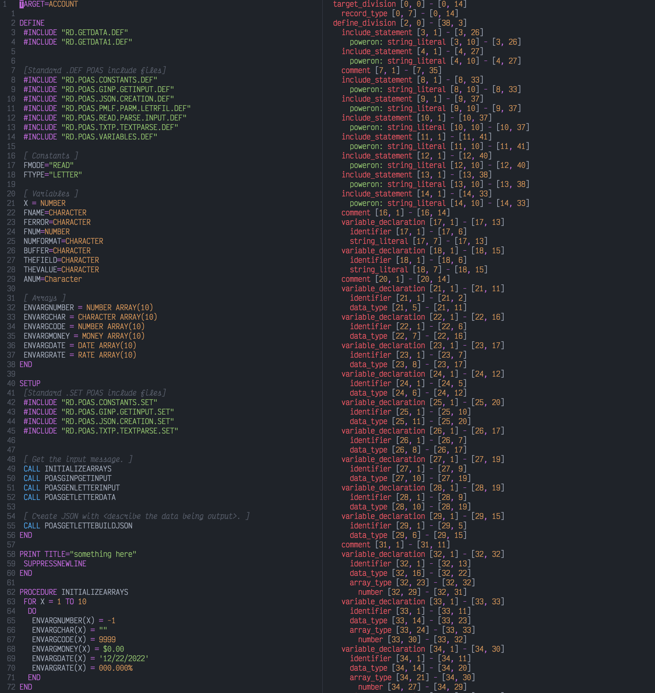

# @phileagleson/treesitter-poweron

## About this project

This is a [tree-sitter](https://tree-sitter.github.io/tree-sitter/) grammar for the PowerOn Programming Language.
While there are still a couple issues it is pretty complete and will parse most poweron files without issues.
PR's Welcome.
---
## For use in Neovim with [Lazy.nvim](https://github.com/folke/lazy.nvim)
NOTE: you will need to manually copy the highlights.scm file to where your plugins are stored.
```Lua
    config = function(_, opts)
        -- below code adds additional parser

        local git_user = "phileagleson"
        local git_repo = "tree-sitter-poweron"
        local git_repo_url = "https://github.com/"..git_user.."/"..git_repo
        local parser_config = require "nvim-treesitter.parsers".get_parser_configs()
        parser_config.poweron = {
            install_info = {
                url = git_repo_url, -- local path or git repo
                files = {"src/parser.c", "src/scanner.cc"}, -- note that some parsers also require src/scanner.c or src/scanner.cc
                -- optional entries:
                branch = "main", -- default branch in case of git repo if different from master
                generate_requires_npm = false, -- if stand-alone parser without npm dependencies
                requires_generate_from_grammar = false, -- if folder contains pre-generated src/parser.c
            },
            filetype = "poweron", -- if filetype does not match the parser name
        }
        vim.treesitter.language.register('poweron', {'poweron', 'po'})
        require("nvim-treesitter.configs").setup(opts)
```
### Screenshot


(The tree-sitter map on the side is created using [Nvim Tree-sitter Playground](https://github.com/nvim-treesitter/playground))
