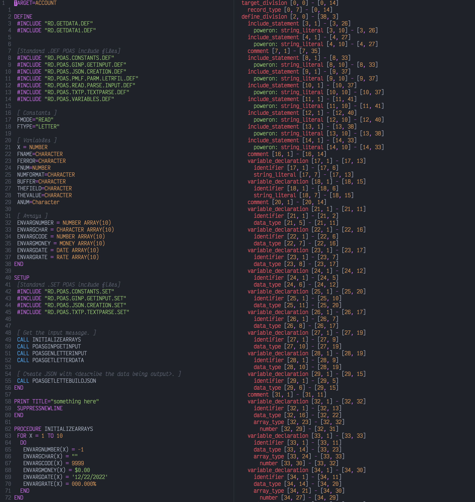

# tree-sitter-poweron

## About this project   

This is the start of a [tree-sitter](https://tree-sitter.github.io/tree-sitter/) grammar for the PowerOn Programming Language.
While definitetly not complete, it is functional at the moment. Note, I would still consider this in it's alpha phase
so be aware if you are using this for queries, there may be breaking changes as the project is developed. 
PR's Welcome.

---
### TODO List:

  * Figure out a regex for multi-line comments - currently struggling with this
  * Add additional poweron functions
  * Add additional keywords
  * Create tests in the corpus/ directory for regression testing
  * Unkown until tested using additional powerons
  
This project was created primarily for me to use to create a poweron language server that implements the Language Serevr
Protocol [LSP Documentation](https://microsoft.github.io/language-server-protocol/specifications/lsp/3.17/specification/)

If interested, this project can be found at [https://github.com/phileagleson/poweronls](https://github.com/phileagleson/poweronls)

### Editor Integration

The process for each editor varies slightly and may require creating a simple plugin for the editor - please check your
editor's documentation for tree-sitter integration.

I'm currently using neovim, so I will share what is needed to make this work:
1. Using any plugin-manager install nvim-treesitter/nvim-treesitter.
2. Since this project is not yet available on npm, you'll need to clone this repo somewhere on your machine
3. Add the following to your init.lua or a required file (see my [dotfiles](https://github.com/phileagleson/dotfiles) repo for an example):
```
--- Note this section can be whatever you'd like. Check out the nvim-treesitter documentation
require 'nvim-treesitter.configs'.setup {
    inednt = {
        enable = true
    },
           ensure_installed = 'all',
           sync_install = false,
           ignore_install = { '' },
           highlight = {
               enable = true
           },
           autopairs = {
               enable = true
           },
           rainbow = {
               enable = true,
               extended_mode = true,
               max_file_lines = nil,
           },
}

local parser_config = require 'nvim-treesitter.parsers'.get_parser_configs()
parser_config.poweron = {
    install_info = {
        url = '/path/to/tree-sitter-poweron', -- update with path to the cloned repo
        files = { "src/parser.c" },
        branch = 'main',
        generate_requires_npm = false,
        requires_generate_from_grammar = false,
    },
    filetype = 'poweron'
}
```
4. Create a filetype.lua file in your neovim config directory with the following contents
```
vim.filetype.add({
        extension = {
        pnd = 'poweron',
        PND = 'poweron',
        po = 'poweron',
        PO = 'poweron',
        pro = 'poweron',
        PRO = 'poweron',
        def = 'poweron',
        DEF = 'poweron',
        sub = 'poweron',
        SUB = 'poweron',
        }
        })
```
This makes files with the listed extensions be identified as "poweron". This could be updated to use a regex pattern
to include something like \[1-9]{3}\ to match a .XXX extension. you can also manually set the filetype using 
```
:set filetype=poweron
```
***NOTE:*** Setting the filetype in lua requires turning it on, so you'll also need to add:
```
vim.g.do_filetype_lua = 1
```
somewhere in your init.lua

5. Finally, in order to see the syntax highlighting provided by tree-sitter you'll need to copy the tree-sitter queries from 
the repo to somewhere in your neovim runtimepath. I have this in my init.lua
```
vim.cmd[[
    set runtimepath+=~/.config/nvim/queries
]] 
```
From your terminal prompt run the command:
```
cp /path/to/tree-sitter-poweron/queries/highlights.scm ~/.config/nvim/queries/poweron/highlights.scm
```
---
Of course, for any of this to have an effect, you'll need to be using a colorscheme that utilizes tree-sitter.
A good list can be found at [https://github.com/nvim-treesitter/nvim-treesitter/wiki/Colorschemes](https://github.com/nvim-treesitter/nvim-treesitter/wiki/Colorschemes)
I'm currentl using onedark with the "darker" style

### Screenshot


(The tree-sitter map on the side is created using [Nvim Tree-sitter Playground](https://github.com/nvim-treesitter/playground))
